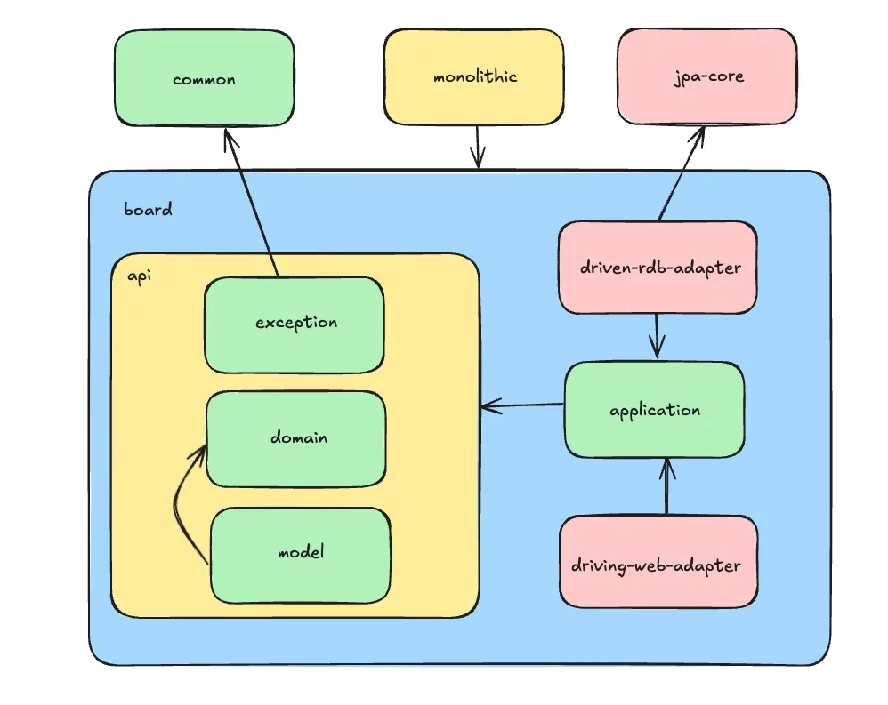

# demo-multi-module

```
multi-module
├─ common
├─ monolithic
├─ core
│  └─ jpa-core
└─ services
    └─ board
        ├─ api
        │   ├─ exception
        │   ├─ domain
        │   └─ model
        ├─ application
        ├─ driven-rdb-adapter
        └─ driving-web-adapter
```

---


